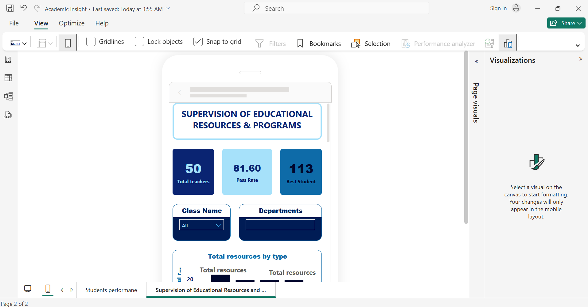
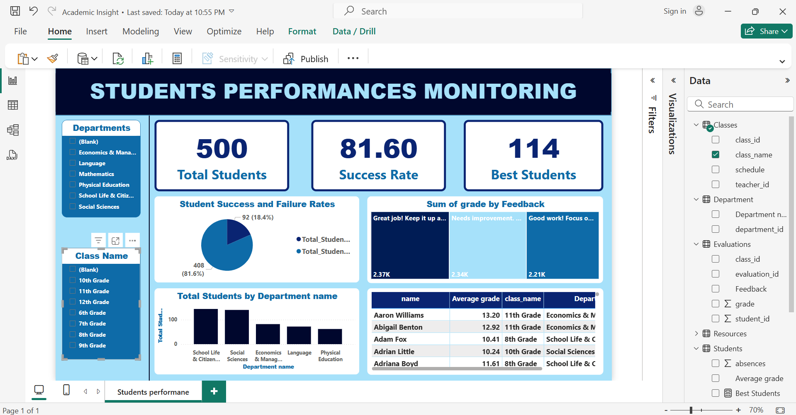

# EduSight 🎓📊  
*Data-driven Insights for Smarter Education*

> An intelligent dashboard designed to improve access to quality education through the power of data.

---

## 🎯 Purpose

**EduSight** is a data visualization project built to turn raw educational data into **strategic, human-centered decisions**. It targets **NGOs**, **schools**, and **public policy makers** aiming to:

- Monitor academic performance 📈  
- Track and optimize teaching resources 📚  
- Evaluate the effectiveness of learning programs 🎓  

---

## 🧠 Context

Behind every dataset is a student.  
A dream. A future.

In many underserved areas, **decisions are made blindly** due to a lack of actionable insights.  
**EduSight** bridges that gap by turning disconnected spreadsheets into **clear, strategic dashboards**.

---

## 🛠️ Tech Stack

- **Power BI**: Dynamic visualizations, KPIs, and interactive filters  
- **Excel**: Data querying and storage  
- **Python**: Data processing and automation  
- **Data Modeling**: Logical structuring of educational indicators

---

## 📊 Key Features

- 📍 Interactive Power BI dashboard  
- 🎛️ Cross-filtering by class, subject, department, or year  
- 🔢 Key performance indicators:
  - Pass & failure rates  
  - Learning resource availability  
  - Year-over-year trends  
- 🔎 Multi-level analysis: students, teachers, and programs

---

## 🖼️ Visual Preview

---

## 💡 Use Cases

1. **Education-focused NGOs**: Track and communicate program impact  
2. **Governments & Ministries**: Improve planning and resource allocation  
3. **School Directors & Coordinators**: Identify gaps and improve student outcomes

---

## 🌍 Social Impact

> EduSight is more than just a BI tool.  
> It's a **mission-oriented analytics solution**.  
> Because **every data point is a child's opportunity** — and we should never lose sight of that.

---

## 🤝 Collaborate With Me

Do you work in education, humanitarian tech, or social impact analytics?  
Looking to deploy smart dashboards in your organization?

📩 Reach out: [abdiasarsene@gmail.com]  
🔗 LinkedIn: [Abdias Arsène. Z 📊📈](https://www.linkedin.com/in/abdias-arsene)

---

## 📄 License

This project is licensed under the MIT License.

---

## 🏷️ Tags

`#DataForGood` `#EducationAnalytics` `#PowerBI` `#HumanitarianTech` `#DataScience`  
`#NGO` `#SocialImpact` `#OpenData` `#DataDrivenDecisions`
